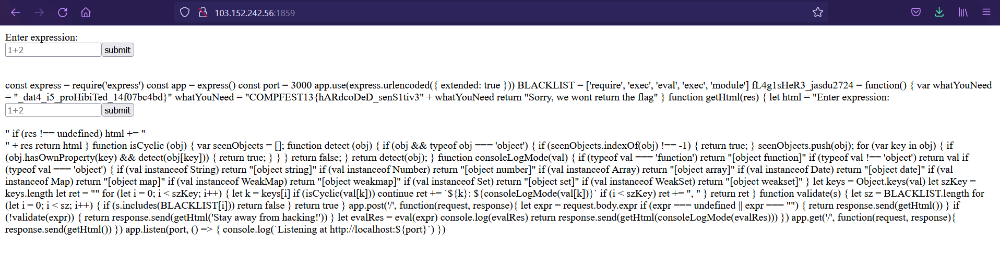

# BabyJS

## POC

When I tried to search 'BabyJS' on google, I found a writeup where the title of the challenge is the same as 'Referensi 1'(Look at References section). 
Then, I tried to use the RCE payload from 'Referensi 1'. 
However, the payload doesn't work because the server blocks 'require' by giving 'Stay away from hacking' response and the accepted payload is 

```javascript
const process = this.constructor.constructor('return this.process')(); process.mainModule
```

Next, I found 'Referensi 2' on google where 'require' for importing child_process module can be replaced by '_load'. 
In contrast, execSync() is also blocked by the server and the accepted payload is 

```javascript
const process = this.constructor.constructor('return this.process')(); process.mainModule.constructor._load('child_process')
```

Moreover, execSync() is also blocked. 
Finally, I tried spawnSync() from 'Referensi 3' and it works.
So, I tried to call ls with spawnSync() and it works.\
\
\
\
Then, The flag could be retrieved by using spawnSync() to 'cat' index.js file.\
\


## References

* [Reference 1](https://pwnisher.gitlab.io/nodejs/sandbox/2019/02/21/sandboxing-nodejs-is-hard.html)
* [Reference 2](https://licenciaparahackear.github.io/en/posts/bypassing-a-restrictive-js-sandbox/)
* [Reference 3](https://www.tabnine.com/code/javascript/functions/spawnSync)
