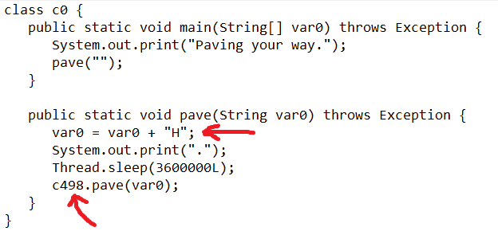

# Pave the way

## POC

Given a jar file (chall.jar.zip is the decompilation result of the jar file). 
In order to look at the java source code, we can use [https://www.decompiler.com/](https://www.decompiler.com/) to decompile the given jar file. 
When we unzip the decompilation result, there are 1000 java files. 
Each java file has this structure :\
\
\
\
Based on the picture above, logically, the program flow is assigning var0 with a character and call another program / file. 
So, var0 contains a character to obtain the flag and the following file contains the next character. 
However, due to a lot of files to be checked to obtain the flag, we have to make a script. 

Here is the flow of solve.py : 
1. Find all java files which contains C for var0 because the flag starts with 'C'
2. Call the other programs specified by those files in step 1
3. Repeat the step in number 2 recursively until we get '}' which indicates the end of the flag.

Last thing to notice, we don't know the length of the flag, that's why we have to repeat the process of number 2 recursively like we tried to check all possible answers. 
If you want to look at the process of the given flow above, you can uncomment some commented print statement in solve.py.
