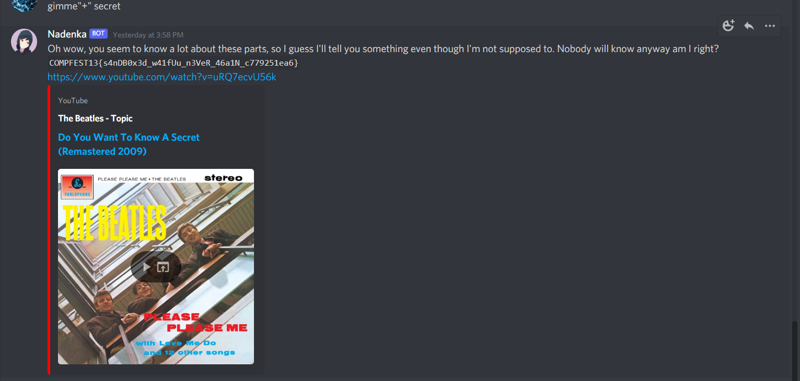

# Waifudroid

## POC

Given a source code (app.js) and a bot in discord server.
Based on app.ks, in order to get 'secret', 'content' has to be 'gimme secret'.
If we give 'gimme secret' to the bot, 'gimme secret' will be stripped.
If we made it nested like 'gimme gimme secretsecret', the result will be the same because sanitize() called recursively.
When I look into the detail, there are double-quotes inside single quote, Then **gimme"+" secret** will be truncated as "gimme secret" inside the vm class and sanitize() won't strip the string.\
\

