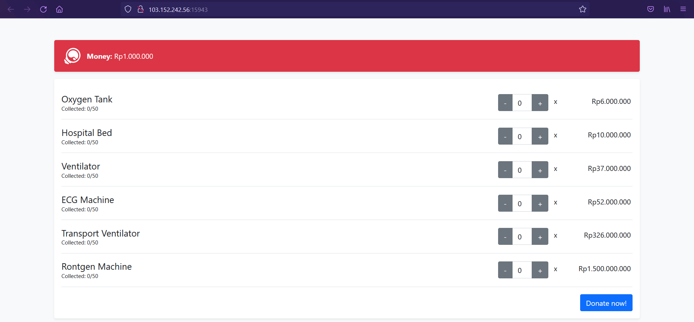
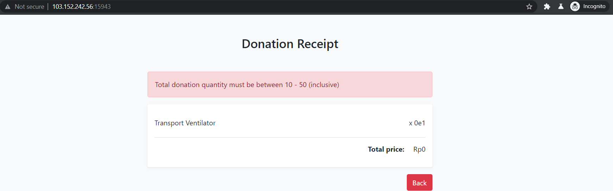
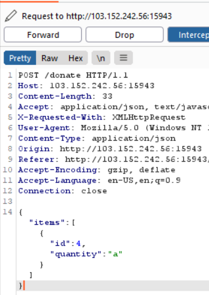
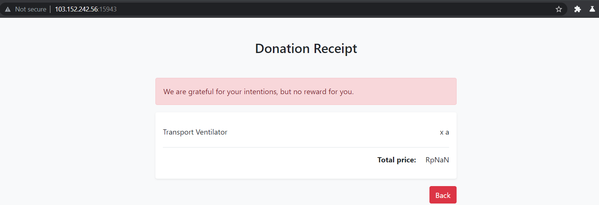
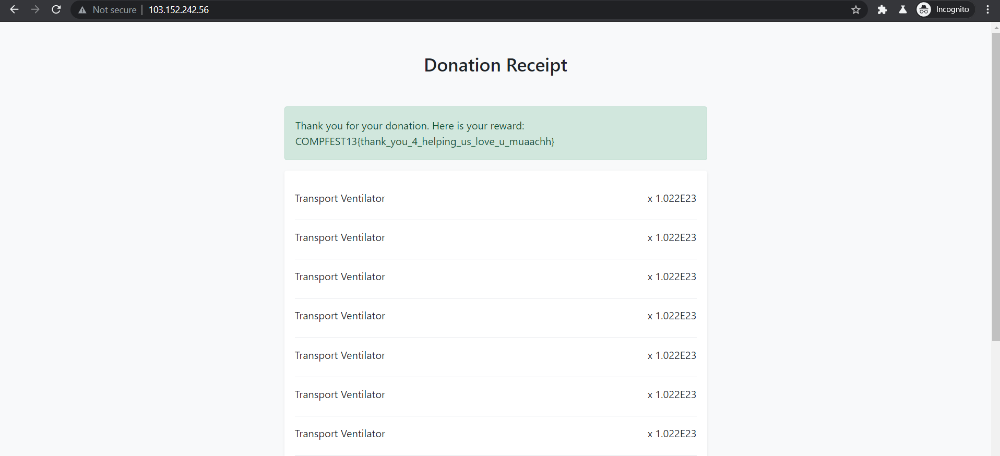

# Hospital donation

## POC

Given a web page and we have to collect 10 'Transport ventilator'.\
\
\
\
I tried to give 0 to change the price down to 0 but the total also become 0.\
\
\
\
Then, I tried to use burp and modify 'quantity' with a character.\
\
\
\
The result :
\
\
\
Based on the picture above, the price become 'NaN' which indicates that the server use javascript.
"items" on the third picture is an array, we could order/create 10 items (10 jsons inside the array) dan each item has its quantity 1 but the price become lower.
In index.js, quantity passed to parseInt() and on the reference referensi in Reference section, parseInt has a bug when given a really huge number.
So, there are 2 tricks in order to obtain the flag :
1. Create 10 items with quantity  = "1.01E23"
2. Create 1 item with quantity = "10.01E23"

## Reference

* [parseInt() bug, MDN](https://developer.mozilla.org/en-US/docs/Web/JavaScript/Reference/Global_Objects/parseInt?retiredLocale=id#description)
